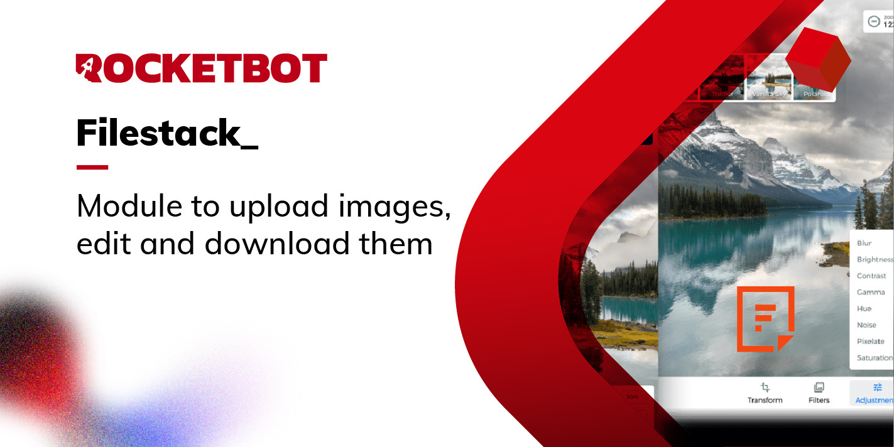

# Filestack
  
Module to work with Filestrack  
  

## How to install this module
  
__Download__ and __install__ the content in 'modules' folder in Rocketbot path  

## Description of the commands

### Upload Image
  
Upload an image
|Parameters|Description|example|
| --- | --- | --- |
|Api Key||ovx7TZ12QkCKXbDX04u|
|Path to file||C:/Users/Usuario/Desktop/img.jpg|
|Result||Variable|

### Resize Image
  
Resize an image
|Parameters|Description|example|
| --- | --- | --- |
|Image ID||ovx7TZ12QkCKXbDX04u|
|Width||500|
|Height||500|
|Scale|||
|Result||Variable|

### Crop Image
  
Crop an Image
|Parameters|Description|example|
| --- | --- | --- |
|Image ID||ovx7TZ12QkCKXbDX04u|
|Position X||10|
|Position Y||10|
|Width||500|
|Height||500|
|Result||Variable|

### Download Image
  
Download an image
|Parameters|Description|example|
| --- | --- | --- |
|Image ID||ovx7TZ12QkCKXbDX04u|
|Path to download th file||C:/Users/User/Desktop|
|File name||test.jpg|
