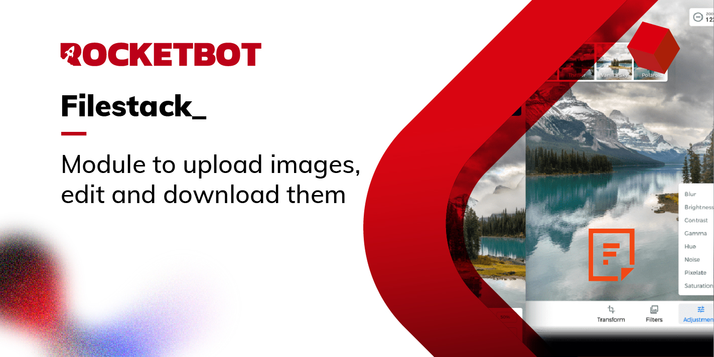

# Filestack
  
Módulo para trabajar con Filestrack  
  

## Como instalar este módulo
  
__Descarga__ e __instala__ el contenido en la carpeta 'modules' en la ruta de Rocketbot.  

## Descripción de los comandos

### Subir Imagen
  
Subir una imagen
|Parámetros|Descripción|ejemplo|
| --- | --- | --- |
|Api Key||ovx7TZ12QkCKXbDX04u|
|Ruta al archivo||C:/Users/Usuario/Desktop/img.jpg|
|Resutlado||Variable|

### Redimensionar Imagen
  
Redimensionar una imagen
|Parámetros|Descripción|ejemplo|
| --- | --- | --- |
|ID Imagen||ovx7TZ12QkCKXbDX04u|
|Ancho||500|
|Alto||500|
|Escalar|||
|Resutlado||Variable|

### Cortar Imagen
  
Cortar una Imagen
|Parámetros|Descripción|ejemplo|
| --- | --- | --- |
|ID Imagen||ovx7TZ12QkCKXbDX04u|
|Posición X||10|
|Posición Y||10|
|Ancho||500|
|Alto||500|
|Resutlado||Variable|

### Bajar Imagen
  
Bajar una imagen
|Parámetros|Descripción|ejemplo|
| --- | --- | --- |
|ID Imagen||ovx7TZ12QkCKXbDX04u|
|Ruta donde descargar el archivo||C:/Users/User/Desktop|
|Nombre de archivo||test.jpg|
